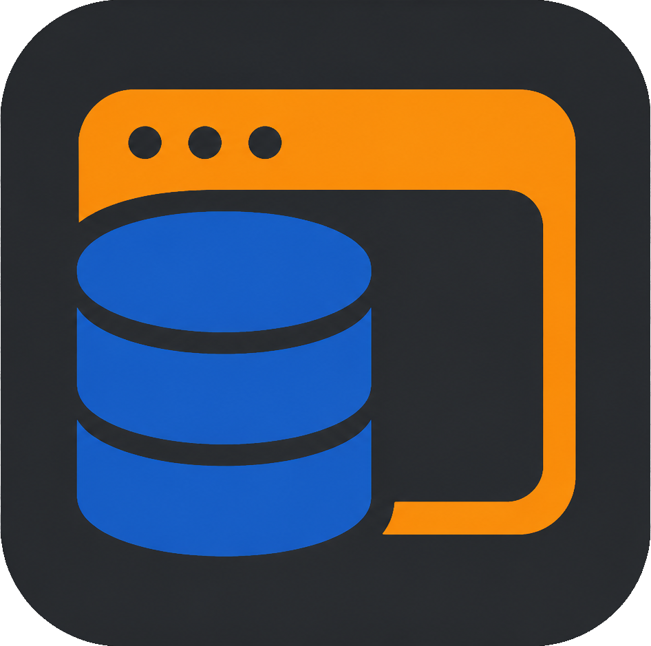

# DynamoDb-GUI-Client

This project is a fork maintained from the original DynamoDb-GUI-Client
(https://github.com/Arattian/DynamoDb-GUI-Client). Thanks to previous devs for their hard work.

[](#contributors)

## Desktop GUI client for DynamoDB

[](https://github.com/Arattian/DynamoDb-GUI-Client/blob/master/LICENSE)

### [Latest release](https://github.com/Munawwar/DynamoDb-GUI-Client/releases)



:eyes:


## Run

Fast desktop dev mode with Vue HMR:

```bash
npm run dev
```

Browser-only dev mode:

```bash
npm run dev:browser
```

Production-like Electron run:

```bash
git clone https://github.com/Munawwar/DynamoDb-GUI-Client.git
cd DynamoDb-GUI-Client
npm i
aws sso login --profile <your-profile>
npm start
```

## Package

```bash
git clone https://github.com/Munawwar/DynamoDb-GUI-Client.git
cd DynamoDb-GUI-Client
npm i
npm run package
```

## Features

- [x] Remote Access of AWS DynamoDB Service\*
- [x] Desktop app with local AWS profile access
- [x] AWS SSO / IAM Identity Center profiles via `aws configure export-credentials`
- [x] Automatic credential refresh by re-resolving the selected AWS profile
- [x] Supports switching between multiple local AWS profiles
- View
  - Table view
    - [x] Records view
    - [x] Table schema view
- Operation

  - Record
    - [x] Add Record
    - [x] Edit Record
    - [x] Delete Record
  - Table
    - [x] Add Table
    - [x] Edit Table
    - [x] Delete Table
  - Filter by attribute value
  - Filter by attribute name
